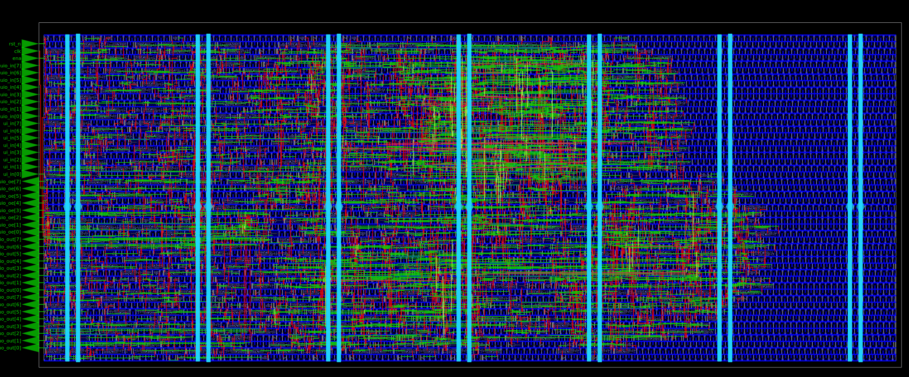

# HeiChips 2025 Tiny Wrapper

This repository contains a wrapper for the
[SDR](https://github.com/RainChinChao/heichips25_SDR_new) and the
[PPWM](https://github.com/towoe/heichips25-ppwm) project, since these occupy
less than half of the small template.



Due to the limited number of pins, only one design can be active at a time. The
designs can be selected using the `ena` input.

| `ena`       | Selected Project   |
|:-----------:|:------------------:|
|  0          |  PPWM              |
|  1          |   SDR              |

## Prerequisites

> [!NOTE]
> The HeiChips VM has Nix already pre-installed.

If you haven't installed Nix yet, please do so using LibreLane's documentation: [Nix-based Installation](https://librelane.readthedocs.io/en/latest/getting_started/common/nix_installation/index.html). 

Now you simply need to execute `nix-shell` at the root directory of this repository to enable all of the required tools. This has to be done each time you open a new shell.

The following tools are included:

- LibreLane and its dependencies
- cocotb with Icarus Verilog and Verilator (WIP)
- GTKWave and Surfer (WIP)
- nextpnr (icestorm, trellis) and openFPGALoader

These tools enable you to implement your macro for the chip, run simulation using cocotb, and emulate your design on an FPGA.

## Simulation and Verification

To verify your design implement a testbench with [cocotb](https://www.cocotb.org/) and, as the underlying simulator, Icarus Verilog or Verilator.

To run the simulation testbench simply execute:

```
make sim
```

> [!IMPORTANT]
> Before you start the gate-level simulation, you need to explicitly enable the PDK so that the testbench can find it.
> Enable the latest version of the PDK using ciel: `ciel enable --pdk-family ihp-sg13g2 cb7daaa8901016cf7c5d272dfa322c41f024931f`

Or for gate-level simulation:

```
make sim-gl
```

By default Icarus Verilog is used as simulator. To use Verilator, simply set `export SIM=verilator` and run the testbench again.

The waveforms are stored under `tb/sim_build/*.fst`.

You can view the waveforms using, e.g., GTKWave:

```
gtkwave tb/sim_build/heichips25_template.fst
```

Make sure to update the testbench for your design.

## Emulation on FPGA

The following FPGA boards are supported by the Makefile:

- [iCEBreaker](https://icebreaker-fpga.org/)
- [ULX3S](https://radiona.org/ulx3s/)
- [iCE40HX8K-EVB](https://www.olimex.com/Products/FPGA/iCE40/iCE40HX8K-EVB/)
- [Tang Nano 9K](https://wiki.sipeed.com/hardware/en/tang/Tang-Nano-9K/Nano-9K.html)
- [Basys 3](https://digilent.com/reference/programmable-logic/basys-3/start)

> [!IMPORTANT]
> You have to edit the top-level module under `fpga/<board_name>/<board_name>_top.sv` for your FPGA board so that it is compatible with your HeiChips design.

The make targets for iCE40HX8K are:

```
make synth-ice40hx8k
make pnr-ice40hx8k
make upload-ice40hx8k
```

The make targets for iCEBreaker are:

```
make synth-icebreaker
make pnr-icebreaker
make upload-icebreaker
```

The make targets for Nano 9K are:

```
make synth-nano9k
make pnr-nano9k
make upload-nano9k
```

The make targets for ULX3S are:

```
make synth-ulx3s
make pnr-ulx3s
make upload-ulx3s
```

> [!IMPORTANT]
> Support for Basys 3 (Artix7) is not yet upstreamed in nextpnr. Thus we make use of the excellent [openXC7](https://github.com/openxc7) project, which provides a fork of nextpnr called `nextpnr-xilinx`.
> However, this also means that the setup is slightly different. Instead of invoking `nix-shell` at the root of this repository, you need to invoke `nix-shell` inside of `nix-opencx7/`.

The make targets for Basys 3 are:

```
make synth-basys3
make pnr-basys3
make upload-basys3
```


## Physical Implementation using LibreLane

To implement the macro of your project, run the following make target, which invokes LibreLane:

```
make macro
```

To view the macro in the OpenROAD GUI:

```
make macro-openroad
```

To view the layout of the macro with KLayout:

```
make macro-klayout
```

## Submission

Checklist:

- [x] The project top-level has a unique name starting with `heichips25_`.
- [x] The design is verified and tested.
- [x] The macro is stored under `macro/`.
- [x] `TopMetal2` in the macro is empty (for integration).
- [x] The macro is DRC clean (minimal DRC set without fill checks).
- [x] The macro uses the default power pins (VPWR, VGND).
- [x] The project is licensed under Apache 2.0.

## License

The code in this repository is licensed under Apache 2.0.
