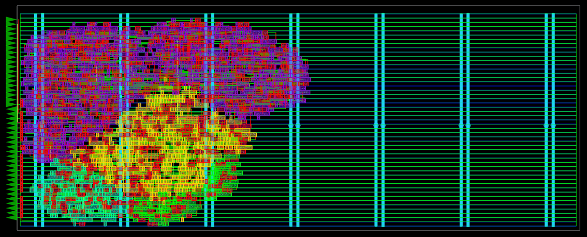

# HeiChips 2025 Programmable PWM

## Overview

This project aims to create a programmable PWM module.
In this context, "programmable" signifies that the module is initialized with a set of instructions.
These instructions are then executed by its internal state machine, enabling dynamic PWM behavior.
This allows for modifications to the PWM characteristics over time.
A practical application of this would be, for instance, creating a pulsing LED effect.

## Design

The hardware is structured into different blocks:
- memory:
  - serial input for programming
  - program counter to access the instructions
- global counter:
  - provide a long term counter for time resolution in the magnitude of seconds
- execution:
  - state machine to calculate the PWM duty cycle
- pulse width modulation
  - fixed pulse width and adjustable duty cycle

The program allows for 16 different instructions, and is allowed to run for 1024
cycles before the PWM value is sampled by the PWM module.
The program can pause before reaching this cycle limit and can resume in the
next iteration, changing the value over time.

### Instructions

The state machine support 7 different instructions. Some instructions can do
multiple things to make use of remaining bits in one instruction.

- ctrl (nop, wait)
- set
- arith (add, sub)
- shift
- jump
- cmp (global counter high, global counter low, 2 registers)
- branch

Instructions are 7 bit long. The opcode is 3 bit long. One bit is used to
differentiate between two registers. The immediate value is between 2 and 3
bits. Control transfer has access to 4 bits.

### Registers

The execution unit stores 2 values. Both are 10 bit wide, the same width as the
PWM max value.
One register is used to forward the new duty cylce to PWM. The other register
serves to hold user values.

### Memory

The memory is 7 x 16 bits, allowing for 16 instructions.
All 16 locations can be reached by the 4 bit wide control transfer.

### Global counter

The global counter uses 20 bit, make both halves fully accessible by the
comparison operation.

### PWM

The counter for PWM is 10 bit wide. As long as the counter is smaller than the
value receive by the execution unit, the output line is low.

## Program example

A simple program which increases the PWM value only if the lower global counter
bits are smaller than the REG value.
The underscores are separating the different groups in the instructions.
Control transfer values are given in the offset to the current instruction.

```
    011_0_001  #0 set pwm 3
    011_1_001  #1 set reg 3
    0_001_110  #2 cmp gcntl < reg
    _0010_111  #3 branch #5
    _0010_101  #4 jump #6
    001_0_010  #5 add pwm 1
    _0001_000  #6 wait
    _1010_101  #7 jump #2
```

## Physical results

__Area__
OpenROAD reports an area usage of 30500 um². Memory uses 11500 um² alone.



## Open questions

__Frequency__
The PWM output is directly tied to the clock frequency of the design.
The input frequency will also affect the scale of the global counter.

__Instruction memory__
The current implementation requires a clock synchron programming of the memory.
Also, the memory take a major area in the design.
Depending on the overall system, changes here might be sensible.
It would be within the program execution if the instruction fetch takes more
than one cycle.

## License

The code in this repository is licensed under Apache 2.0.
